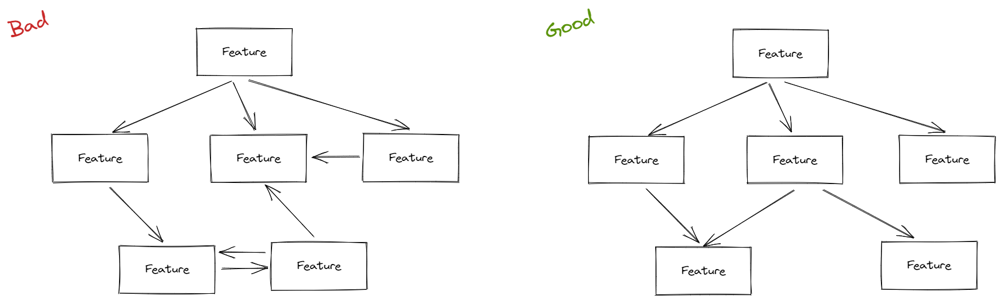
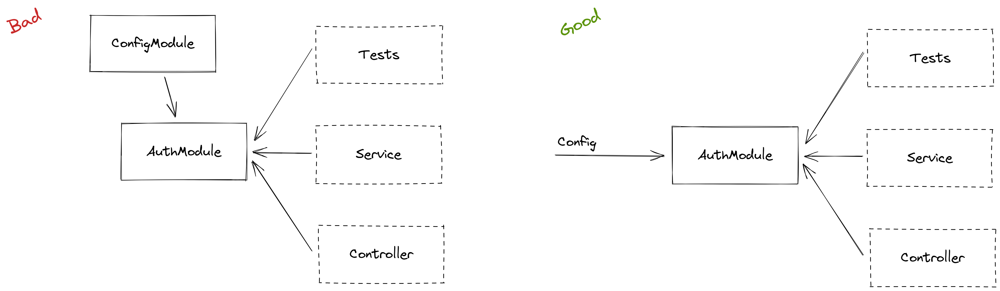
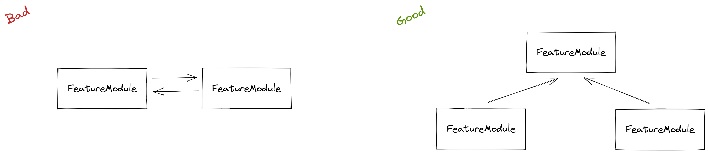

# Dependency Injection

Pages describes the main purpose of DI

## Problem

Many new developers do not know what CI is and how to use it. How to design systems built on DI, what is IoC, and the result is a confusing relationship between modules in the application

## Solution

> In software engineering, dependency injection is a design pattern in which an object or function receives other objects or functions that it depends on. A form of inversion of control, dependency injection aims to separate the concerns of constructing objects and using them, leading to loosely coupled programs. The pattern ensures that an object or function which wants to use a given service should not have to know how to construct those services. Instead, the receiving 'client' (object or function) is provided with its dependencies by external code (an 'injector'), which it is not aware of.
>
> Dependency injection helps by making implicit dependencies explicit and helps solve the following problems
> How can a class be independent from the creation of the objects it depends on?
> How can an application, and the objects it uses support different configurations?
> How can the behavior of a piece of code be changed without editing it directly?
>
> Read more in [Wikipedia](https://en.wikipedia.org/wiki/Dependency_injection)

Initially, NestJS doesn't tell us how to properly design code, what folder structure to use, and how to deal with typical module dependency problems. Because of this, developers write code differently. Even if they are doing the same project, the code in microservices can be very different.

Here, I will try to describe the known problems that I encountered and how I solved them.

### Architectual design

By architecture, I mean the relationship between modules. It should be hierarchical, not chaotic. Design communication between modules in advance, use diagram to outline all cases. Divide your logic into scopes and never use circular dependencies.



### Applications and Libraries

> This part was taken from [NX documentation](https://nx.dev/more-concepts/applications-and-libraries)

A workspace is structured into "apps" and "libs". This distinction allows us to have a more modular architecture by following a separation of concerns methodology, incentivising the organization of our source code and logic into smaller, more focused and highly cohesive units.

Therefore, consuming libraries is very straightforward, and similar to what you might already be accustomed to in previous projects.

Having a dedicated library project is a much stronger boundary compared to just separating code into folders, though. Each library has a so-called "public API", represented by an index.ts barrel file. This forces developers into an "API thinking" of what should be exposed and thus be made available for others to consume, and what on the others side should remain private within the library itself.

#### Misconception

Developers new to Nx are initially often hesitant to move their logic into libraries, because they assume it implies that those libraries need to be general purpose and shareable across applications.

**This is a common misconception, moving code into libraries can be done from a pure code organization perspective.**

> Ease of re-use might emerge as a positive side effect of refactoring code into libraries by applying an "API thinking" approach. It is not the main driver though.
>
> In fact when organizing libraries you should think about your business domains.
>
> Most often teams are aligned with those domains and thus a similar organization of the libraries in the libs/ folder might be most appropriate. Nx allows to nest libraries into sub-folders which makes it easy to reflect such structuring.

A common mental model is to **see the application as "containers"** that link, bundle and compile functionality implemented in libraries for being deployed. As such, if we follow a 80/20 approach:

- place 80% of your logic into the libs/ folder
- and 20% into apps/

Let's take a look to this structure

```
apps/
  api/
  api-e2e/
libs/
  core/                    <---- grouping folder
    prisma-client/         <---- core database library
    errors/                <---- core library
  feature1/                <---- feature library
  feature2/                <---- feature library
```

Graph will look like this


### Good module rule

#### What are common mistakes while creating a new module?

1. You have a new entity in your database
1. You have relationships between your business entities
1. You have large amount of code
1. You have circular dependencies

#### When are modules needed?

1. When you want to publish a part of the project into the npm package
1. When you want to share a part of the project between different applications
1. When there are several teams within the project and it is necessary to share responsibility
1. When you write integration tests, and in order not to run the entire application with all dependencies, you run only a part

#### What should be the module?

1. **Isolated.** At best, the module should not depend on anything, so that copying it would be easy. But in practice, isolated modules are not always obtained. Then it is important to correctly design the architecture so that there is minimal connectivity between modules.
1. **Easy to test.** The module should be designed to be as easy to test as possible.
1. **Independent.** If you want to move some part of the logic into a module, its dependencies should be direct and explicit. A good example of module misuse is the ConfigModule which is globally injected into all modules. This means that every module in the application depends on the ConfigModule, although this could have been avoided by accepting the configs when the module was imported.

Try not to use ConfigModule in your modules. If module need something, you can create a config and forRoot() functions to import variables into your module as a provider



To avoid circular dependencies you can create a new module that will import all others modules. Also, CD says you that you have a bad module design, maybe you can join your module logic?



You should also keep your dependencies in direct hierarchical way


