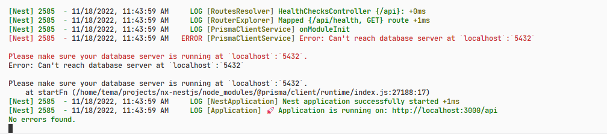

# Health Checks

```mdx-code-block
import BrowserWindow from '@site/src/components/BrowserWindow';
```

Page describes how to break the link between the application and the connected services (DB, RMQ, Kafka, etc)

## Problem

Imagine a huge application with a bunch of internal services, you are tasked with changing the pipe in one of the controllers. Pipe has nothing to do with the database or Kafka. In order to run the application and test the pipe, you will need to bring up the database and all external services. Not very convenient, huh?

How to run an application that does not depend on a database, kafka or any other internal services? How to get service connection status from an application?

## Solution

Do not terminate the application if the connection to internal services failed. The application should work even if it is not connected to the database

> A health check represents a summary of health indicators. A health indicator executes a check of a service, whether it is in a healthy or unhealthy state. A health check is positive if all the assigned health indicators are up and running.

Create a HealthCheckModule with a controller

```ts title="libs/core/health-checks/src/lib/health-checks.controller.ts"
import { Controller, Get, Logger } from '@nestjs/common';
import { CustomInject } from 'nestjs-custom-injector';
import { HEALTH_CHECKS_PROVIDER } from './health-checks.config';
import { HealthCheckResult } from './interfaces/health-check-result.interface';
import { HealthIndicator } from './interfaces/health-indicator.interface';

@Controller()
export class HealthChecksController {
  private _logger = new Logger(HealthChecksController.name);
  private _appStartedAt: number = Date.now();

  @CustomInject<HealthIndicator>(HEALTH_CHECKS_PROVIDER, {
    multi: true,
  })
  private healthIndicators!: HealthIndicator[];

  @Get('/health')
  async check(): Promise<HealthCheckResult> {
    const timestamp = Date.now();
    const uptime = Math.floor((timestamp - this._appStartedAt) / 1000);

    const services = await Promise.all(
      this.healthIndicators.map(
        async (indicator) => await indicator.isHealthy()
      )
    );

    const successfulServices = services.filter((s) => s.status === 'up').length;
    const ratio = +(successfulServices / services.length).toFixed(2);

    return {
      ratio,
      uptime,
      timestamp,
      services,
    };
  }
}
```

Then catch connection error of your ORM or transport service. As example I use Prisma client

```ts title="libs/core/prisma-client/src/lib/prisma-client.service.ts"
async onModuleInit(): Promise<void> {
    try {
        // connect to the database
        await this.$connect()
    } catch (err) {
        // do not throw error here
        this.logger.error(err, err.stack)
    }
}
```

Create a Prisma Health Indicator

```ts title="libs/core/prisma-client/src/lib/prisma-client-connection.health.ts"
import { Injectable } from '@nestjs/common';
import { HealthIndicator, HealthIndicatorResult } from '@nx/core/health-checks';
import { PrismaClientService } from './prisma-client.service';

@Injectable()
export class PrismaClientConnectionHealthIndicator implements HealthIndicator {
  name = 'database';

  constructor(private readonly prismaClientService: PrismaClientService) {}

  async isHealthy(): Promise<HealthIndicatorResult> {
    try {
      await this.prismaClientService.$queryRaw<
        { dt: string }[]
      >`SELECT now() dt`;

      // drop here everything you want
      return {
        name: this.name,
        status: 'up',
      };
    } catch (error) {
      return {
        name: this.name,
        status: 'down',
        error: error.message,
      };
    }
  }
}
```

As a result we have

````mdx-code-block
<BrowserWindow url="http://localhost:3000/api/health" minHeight={240}>

```json
{
  "ratio": 1,
  "uptime": 5,
  "timestamp": 1675597500626,
  "services": [
    {
      "name": "database",
      "status": "up",
    },
    {
      "name": "my-service",
      "status": "up",
      "details": {
        "entitiesCreated": 500
      }
    }
  ]
}
````

</BrowserWindow>

With Prisma connection error application is still working



:::tip

Checkout full example [here](https://github.com/temarusanov/nx/tree/master/libs/core/health-checks/src/lib)

:::
