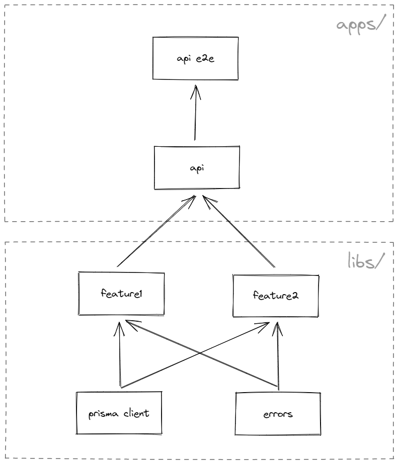
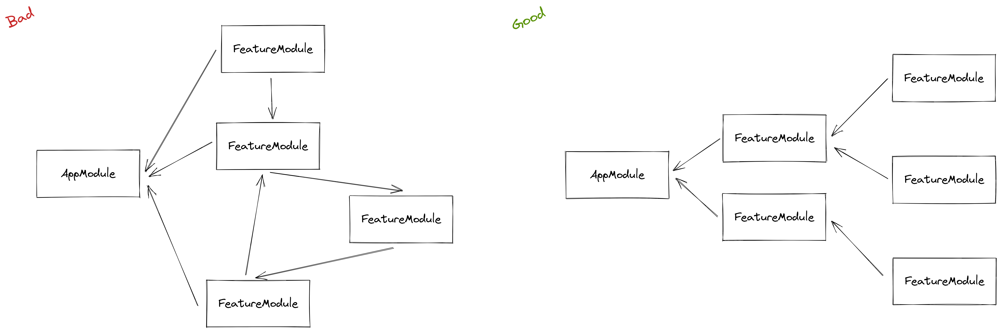

# Внедрение зависимостей

Страница описывает основную цель DI

## Проблема

Многие новые разработчики не знают, что такое DI и как его использовать. Как проектировать системы, построенные на DI, что такое IoC, и в результате — запутанные отношения между модулями в приложении

## Решение

> В разработке программного обеспечения внедрение зависимостей — это шаблон проектирования, в котором объект или функция получает другие объекты или функции, от которых он зависит. Форма инверсии управления, внедрение зависимостей направлено на разделение проблем создания объектов и их использования, что приводит к слабосвязанным программам. Шаблон гарантирует, что объект или функция, которые хотят использовать данный сервис, не должны знать, как создавать эти сервисы. Вместо этого принимающий «клиент» (объект или функция) получает свои зависимости от внешнего кода («инжектора»), о котором он не знает.
>
> Внедрение зависимостей помогает сделать неявные зависимости явными и помогает решить следующие проблемы
> Как может класс быть независимым от создания объектов, от которых он зависит?
> Как приложение и используемые им объекты могут поддерживать разные конфигурации?
> Как можно изменить поведение фрагмента кода, не редактируя его напрямую?
>
> Подробнее читайте в [Википедии](https://en.wikipedia.org/wiki/Dependency_injection)

Изначально NestJS не говорит нам, как правильно разрабатывать код, какую структуру папок использовать и как решать типичные проблемы с зависимостями модулей. Из-за этого разработчики пишут код по-разному. Даже если они делают один и тот же проект, код в микросервисах может сильно отличаться.

Здесь я постараюсь описать известные проблемы, с которыми я столкнулся, и то, как я их решил.

### Архитектура

Под архитектурой я подразумеваю отношения между модулями. Он должен быть иерархичным, а не хаотичным. Заранее спроектируйте связь между модулями, используйте схему, чтобы обозначить все случаи. Разделите свою логику на области и никогда не используйте циклические зависимости.


### Приложения и библиотеки

> Эта часть взята из [документации NX](https://nx.dev/more-concepts/applications-and-libraries)

Рабочая область структурирована на «apps» и «libs». Это различие позволяет нам иметь более модульную архитектуру, следуя методологии разделения задач, стимулируя организацию нашего исходного кода и логики в более мелкие, более целенаправленные и тесно связанные блоки.

Таким образом, использование библиотек очень просто и похоже на то, к чему вы, возможно, уже привыкли в предыдущих проектах.

Тем не менее, наличие выделенного библиотечного проекта является гораздо более жесткой границей по сравнению с простым разделением кода на папки. Каждая библиотека имеет так называемый «public API», представленный файлом index.ts. Это вынуждает разработчиков «думать об API» о том, что должно быть раскрыто и, таким образом, сделано доступным для использования другими, а что с другой стороны должно оставаться закрытым в самой библиотеке.

#### Заблуждение

Разработчики, плохо знакомые с Nx, поначалу часто не решаются перенести свою логику в библиотеки, потому что предполагают, что эти библиотеки должны быть общего назначения и использоваться совместно с приложениями.

**Это распространенное заблуждение, что перемещение кода в библиотеки может быть выполнено с точки зрения организации чистого кода.**

> Простота повторного использования может стать положительным побочным эффектом рефакторинга кода в библиотеки с применением подхода «мышления API». Хотя это не главный драйвер.
>
> На самом деле при организации библиотек вы должны думать о своих бизнес-доменах.
>
> Чаще всего команды привязаны к этим доменам, и поэтому аналогичная организация библиотек в папке libs/ может быть наиболее подходящей. Nx позволяет вкладывать библиотеки во вложенные папки, что упрощает отражение такой структуры.

Распространенная ментальная модель состоит в том, чтобы **рассматривать приложение как «контейнеры»**, которые связывают, связывают и компилируют функциональные возможности, реализованные в библиотеках для развертывания. Таким образом, если мы будем следовать подходу 80/20:

- поместить 80% вашей логики в папку libs/
- и 20% на приложения/

Давайте посмотрим на эту структуру

```
apps/
  api/
  api-e2e/
libs/
  core/                    <---- grouping folder
    prisma-client/         <---- core database library
    errors/                <---- core library
  feature1/                <---- feature library
  feature2/                <---- feature library
```

График будет выглядеть так



### Правило хорошего модуля

#### Какие распространенные ошибки при создании нового модуля?

1. У вас появляется новая сущность в БД
1. У вас есть отношения между бизнес сущностями
1. У вас большой объем кода
1. У вас циклические зависимости

#### Когда нужны модули?

1. Когда вы хотите опубликовать ваш код в NPM
1. Когда вы хотите разделить часть проекта между разными приложениями
1. Когда в проекте несколько команд и нужно разделить ответственность
1. Когда пишешь интеграционные тесты, и чтобы не запускать все приложение со всеми зависимостями, запускаешь только часть

#### Какой должен быть модуль?

1. **Изолированный.** В лучшем случае модуль не должен ни от чего зависеть, чтобы его было легко скопировать. Но на практике не всегда получаются изолированные модули. Затем важно правильно спроектировать архитектуру, чтобы связь между модулями была минимальной.
1. **Легко тестировать.** Модуль должен быть максимально прост в тестировании.
1. **Независимость.** Если вы хотите перенести часть логики в модуль, его зависимости должны быть прямыми и явными. Хорошим примером неправильного использования модуля является ConfigModule, который глобально внедряется во все модули. Это означает, что каждый модуль в приложении зависит от ConfigModule, хотя этого можно было бы избежать, приняв конфигурации при импорте модуля.

Старайтесь не использовать ConfigModule в своих модулях. Если модулю что-то нужно, вы можете создать функции config и forRoot() для импорта переменных в ваш модуль в качестве провайдера.


Чтобы избежать циклических зависимостей, вы можете создать новый модуль, который будет импортировать все остальные модули. Также CD говорит вам, что у вас плохой дизайн модуля, может быть, вы можете присоединиться к логике вашего модуля?


Вы также должны хранить свои зависимости в прямой иерархии.


